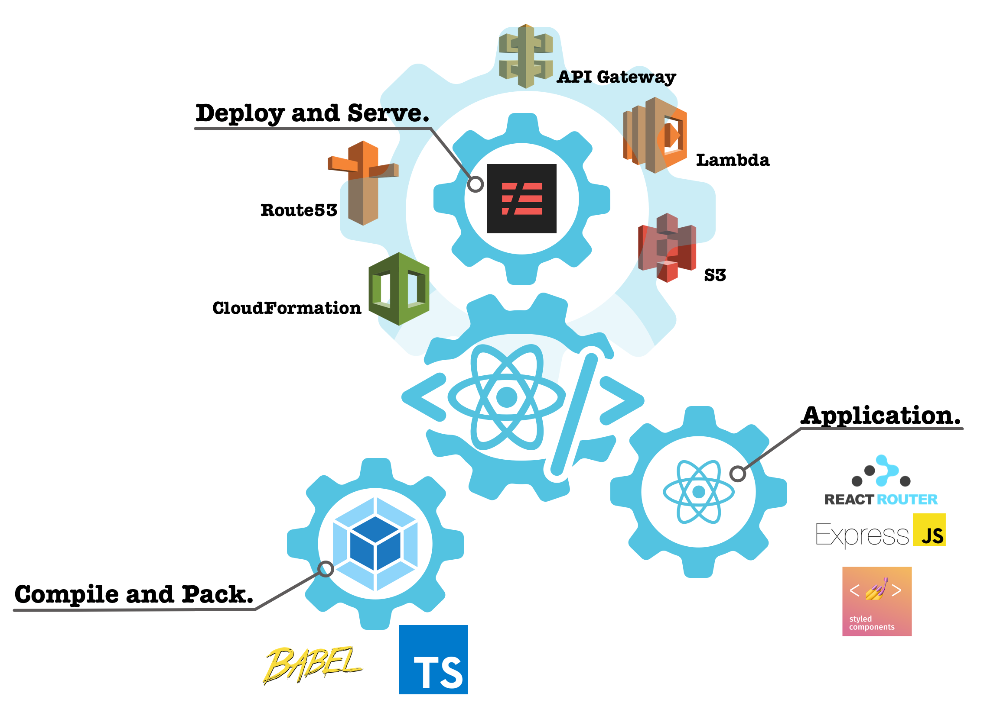

*************************
Infrastructure-Components
*************************

This is a complete Serverless React App!
========================================

Create, Start, and Deploy React Apps easily!::

    import * as React from 'react';

    import { Route, SinglePageApp } from "infrastructure-components";

    export default (
        <SinglePageApp
            stackName = "example"
            buildPath = 'build'
            region='eu-west-1' >

            <Route
                path='/'
                name='Infrastructure-Components'
                render={() => 
Hello from a React Web App!
}/>

        </SinglePageApp>
    );

Infrastructure-Components do all the technical configuration for you
====================================================================

**Compile and Pack**

Infrastructure-Components transpile your Typescript-based React components and bundle them into ready-to-use
packages--without any further configuration required.

* Webpack
* Babel + Loaders
* Typescript

**Application**

Use state-of-the-art libraries to speed up app development.

* React Router
* ExpressJs
* Styled Components
* React Helmet
* GraphQL
* ...

**Deploy and Serve**

Deploy your application with a single command! Infrastructure-Components create the whole infrastructure stack for you.

* Lambda-Functions
* API-Gateway
* S3
* DynamoDB
* CloudFront
* Route53
* CloudFormation
* ...

.. toctree::
   :caption: Contents
   :maxdepth: 2

   installation
   apps
   components
   help